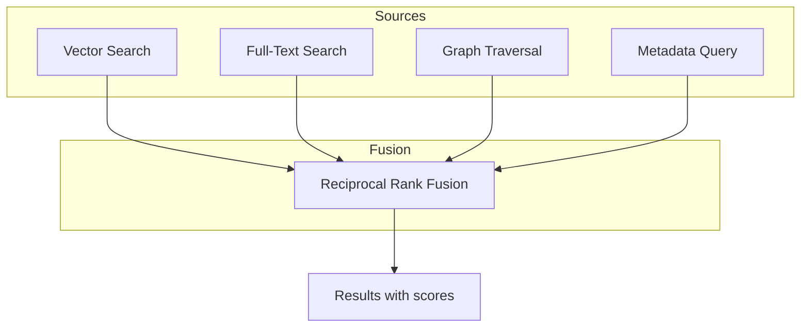
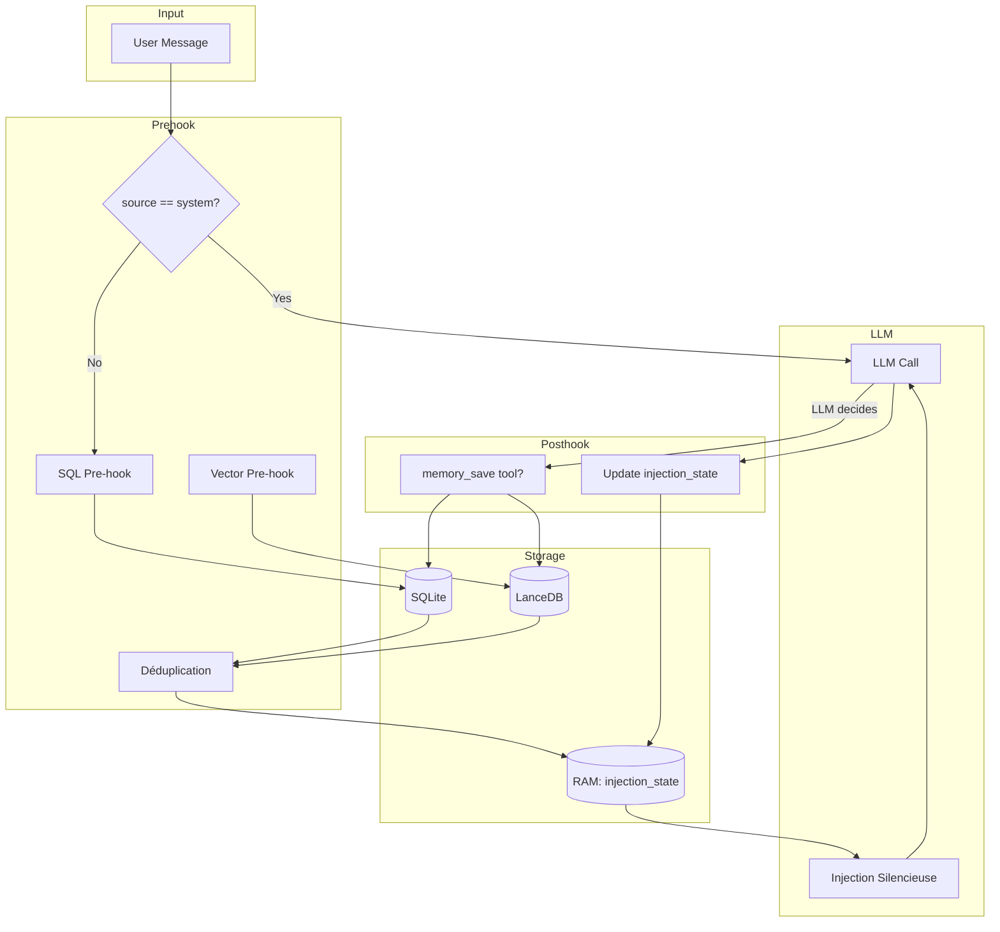

# SpaceBot Memory System: Analyse et Évolution V2

Ce document présente une analyse complète du système de mémoire de SpaceBot, tel qu'il existe actuellement, et l'évolution proposée pour la V2.

---

## 1. Le Système de Mémoire Actuel (V1)

### 1.1 Architecture des Données

SpaceBot utilise **trois bases de données embarquées** pour gérer les mémoires:

| Base | Rôle | Contenu |
|------|------|---------|
| **SQLite** | Données relationnelles | Métadonnées des mémoires, graphe causal |
| **LanceDB** | Recherche vectorielle | Embeddings (HNSW), Full-Text Search (Tantivy) |
| **redb** | Key-value | Configuration, secrets |

### 1.2 Structure d'une Mémoire

**Table SQLite `memories`** (voir [`migrations/20260211000001_memories.sql`](migrations/20260211000001_memories.sql)):

```sql
CREATE TABLE memories (
    id TEXT PRIMARY KEY,              -- UUID
    content TEXT NOT NULL,            -- Contenu textuel (résumé LLM)
    memory_type TEXT NOT NULL,        -- Type de mémoire
    importance REAL DEFAULT 0.5,      -- Score 0.0-1.0
    created_at TIMESTAMP,             -- Date de création
    updated_at TIMESTAMP,             -- Dernière modification
    last_accessed_at TIMESTAMP,       -- Dernier accès
    access_count INTEGER DEFAULT 0,   -- Nombre d'accès
    source TEXT,                      -- Origine (optionnel)
    channel_id TEXT,                  -- Channel associé (optionnel)
    forgotten BOOLEAN DEFAULT FALSE   -- Soft-delete
);
```

**Les 8 types de mémoires** (voir [`src/memory/types.rs`](src/memory/types.rs:91-111)):

| Type | Description | Importance par défaut |
|------|-------------|----------------------|
| `Identity` | Information centrale sur l'utilisateur/agent | 1.0 |
| `Goal` | Objectif à atteindre | 0.9 |
| `Decision` | Choix effectué | 0.8 |
| `Todo` | Tâche actionnable | 0.8 |
| `Preference` | Ce que l'utilisateur aime/n'aime pas | 0.7 |
| `Fact` | Fait brut | 0.6 |
| `Event` | Événement passé | 0.4 |
| `Observation` | Remarque du système | 0.3 |

### 1.3 Comment les Mémoires sont Créées

**Création via l'outil `memory_save`** (voir [`src/tools/memory_save.rs`](src/tools/memory_save.rs:162-257)):

```
┌─────────────┐     ┌─────────────┐     ┌─────────────┐
│   Branch    │────▶│ memory_save │────▶│   SQLite    │
│  (LLM call) │     │    tool     │     │  + LanceDB  │
└─────────────┘     └─────────────┘     └─────────────┘
```

**Processus de création:**
1. Un **Branch** (processus de réflexion) analyse la conversation
2. Le LLM décide de sauvegarder une information importante
3. Appel de l'outil `memory_save` avec:
   - `content`: Description **concise mais complète** (pas une transcription!)
   - `memory_type`: Type approprié
   - `importance`: Score optionnel
   - `source`: Origine de l'information
4. L'embedding est généré automatiquement et stocké dans LanceDB

**Exemple de contenu de mémoire:**
```
"User prefers dark mode in all applications"
"Decision: Use PostgreSQL for the database layer"
"User's birthday is March 15th"
```

### 1.4 Comment les Mémoires sont Récupérées (V1)

**Méthode actuelle: Via un Branch** (voir [`src/agent/branch.rs`](src/agent/branch.rs)):

```
┌─────────────┐     ┌─────────────┐     ┌─────────────┐     ┌─────────────┐
│   Channel   │────▶│   Branch    │────▶│ MemorySearch│────▶│   SQLite    │
│ (message)   │     │  (LLM call) │     │   .search() │     │  + LanceDB  │
└─────────────┘     └─────────────┘     └─────────────┘     └─────────────┘
       │                   │
       │                   ▼
       │           ┌─────────────┐
       │           │  Curated    │
       └──────────▶│  Results    │
                   └─────────────┘
```

**Problèmes de l'approche V1:**
1. **Coût en latence**: ~1-3 secondes pour chaque recherche approfondie
2. **Coût en tokens**: Un appel LLM supplémentaire
3. **Amnésie possible**: Le LLM peut "oublier" de chercher

### 1.5 Recherche Hybride (V1)

**Fichier:** [`src/memory/search.rs`](src/memory/search.rs:146-251)

La recherche hybride combine **quatre sources**:



**Reciprocal Rank Fusion (RRF):**
- Score = Σ(1 / (k + rank)) pour chaque source
- k = 60 (paramètre standard)
- Fusionne les résultats sans normalisation complexe

---

## 2. Le Système de Mémoire V2 (Proposition)

### 2.1 Objectifs

| Objectif | V1 (actuel) | V2 (proposé) |
|----------|-------------|--------------|
| Latence d'injection | 1-3s (LLM call) | < 200ms (0 LLM) |
| Décision de recherche | LLM décide | **Systématique** |
| Déduplication | Aucune | ID + Sémantique |
| Visibilité | Outil explicite | **Invisible** pour l'LLM |

### 2.2 Architecture V2: Les Deux Chemins de Récupération

**Key Insight:** Le pre-hook V2 ne remplace pas le Branch, il l'augmente pour les cas courants.

```
┌─────────────────────────────────────────────────────────────────────────────┐
│                           MEMORY V2 ARCHITECTURE                             │
├─────────────────────────────────────────────────────────────────────────────┤
│                                                                              │
│   ┌─────────────┐                                                           │
│   │   Channel   │                                                           │
│   │  (message)  │                                                           │
│   └──────┬──────┘                                                           │
│          │                                                                   │
│          ▼                                                                   │
│   ┌─────────────────────────────────────────────────────────────────────┐   │
│   │                        PRE-HOOK (V2)                                 │   │
│   │  ┌─────────────────────────────────────────────────────────────┐    │   │
│   │  │                    Chemin 1: SQL Pre-hook                    │    │   │
│   │  │  ┌─────────────┐   ┌─────────────┐   ┌─────────────┐        │    │   │
│   │  │  │  Identity   │   │  Important  │   │   Recent    │        │    │   │
│   │  │  │ (type=Id)   │   │(import>0.8) │   │(last X hrs) │        │    │   │
│   │  │  └──────┬──────┘   └──────┬──────┘   └──────┬──────┘        │    │   │
│   │  │         │                 │                 │                │    │   │
│   │  │         └─────────────────┼─────────────────┘                │    │   │
│   │  │                           ▼                                  │    │   │
│   │  │                  ┌─────────────┐                             │    │   │
│   │  │                  │   SQLite    │                             │    │   │
│   │  │                  │  < 5ms      │                             │    │   │
│   │  │                  └──────┬──────┘                             │    │   │
│   │  └─────────────────────────┼────────────────────────────────────┘    │   │
│   │                            │                                          │   │
│   │  ┌─────────────────────────┼────────────────────────────────────┐    │   │
│   │  │                    Chemin 2: Vector Pre-hook                  │    │   │
│   │  │                           │                                   │    │   │
│   │  │                           ▼                                   │    │   │
│   │  │                  ┌─────────────┐                             │    │   │
│   │  │                  │  Embedding  │                             │    │   │
│   │  │                  │  Generation │                             │    │   │
│   │  │                  └──────┬──────┘                             │    │   │
│   │  │                         │                                     │    │   │
│   │  │                         ▼                                     │    │   │
│   │  │                  ┌─────────────┐                             │    │   │
│   │  │                  │   LanceDB   │                             │    │   │
│   │  │                  │  HNSW Top20 │                             │    │   │
│   │  │                  │  ~50ms      │                             │    │   │
│   │  │                  └──────┬──────┘                             │    │   │
│   │  └─────────────────────────┼────────────────────────────────────┘    │   │
│   │                            │                                          │   │
│   │                            ▼                                          │   │
│   │                  ┌─────────────────┐                                  │   │
│   │                  │  DÉDUPLICATION  │                                  │   │
│   │                  │  ID + Sémantique│                                  │   │
│   │                  │  ~10ms          │                                  │   │
│   │                  └────────┬────────┘                                  │   │
│   │                           │                                            │   │
│   │                           ▼                                            │   │
│   │                  ┌─────────────────┐                                  │   │
│   │                  │  INJECTION      │                                  │   │
│   │                  │  SILENCIEUSE    │                                  │   │
│   │                  │  (clone history)│                                  │   │
│   │                  └────────┬────────┘                                  │   │
│   │                           │                                            │   │
│   └───────────────────────────┼────────────────────────────────────────────┘   │
│                               │                                                │
│                               ▼                                                │
│   ┌───────────────────────────────────────────────────────────────────────┐   │
│   │                           LLM CALL                                     │   │
│   │                   (with injected context)                              │   │
│   └───────────────────────────────────────────────────────────────────────┘   │
│                                                                                │
└─────────────────────────────────────────────────────────────────────────────┘
```

### 2.3 Chemin 1: SQL Pre-hook (Méthodes Existantes + Nouvelle)

**Méthodes existantes dans [`src/memory/store.rs`](src/memory/store.rs):**

| Méthode | Description | Fichier |
|---------|-------------|---------|
| [`get_by_type()`](src/memory/store.rs:307-327) | Récupère par `MemoryType` | Lignes 307-327 |
| [`get_high_importance()`](src/memory/store.rs:330-348) | Récupère `importance >= threshold` | Lignes 330-348 |
| [`get_sorted()`](src/memory/store.rs:354-401) | Récupère trié (Recent/Importance/MostAccessed) | Lignes 354-401 |

**⚠️ Méthode manquante:** Il n'existe PAS de méthode pour filtrer par fenêtre temporelle!

**Nouvelle méthode à ajouter:**

```rust
// Dans src/memory/store.rs
impl MemoryStore {
    /// Get memories created within the specified duration.
    /// 
    /// # Arguments
    /// * `since` - Duration back from now (e.g., Duration::hours(6))
    /// * `limit` - Maximum number of results
    /// * `channel_id` - Optional channel scope
    pub async fn get_recent_since(
        &self, 
        since: chrono::Duration, 
        limit: i64,
        channel_id: Option<&str>,
    ) -> Result<Vec<Memory>> {
        let cutoff = chrono::Utc::now() - since;
        
        let rows = if let Some(cid) = channel_id {
            sqlx::query(
                r#"
                SELECT id, content, memory_type, importance, created_at, updated_at,
                       last_accessed_at, access_count, source, channel_id, forgotten
                FROM memories
                WHERE created_at >= ? AND channel_id = ? AND forgotten = 0
                ORDER BY created_at DESC
                LIMIT ?
                "#,
            )
            .bind(cutoff)
            .bind(cid)
            .bind(limit)
            .fetch_all(&self.pool)
            .await?
        } else {
            sqlx::query(
                r#"
                SELECT id, content, memory_type, importance, created_at, updated_at,
                       last_accessed_at, access_count, source, channel_id, forgotten
                FROM memories
                WHERE created_at >= ? AND forgotten = 0
                ORDER BY created_at DESC
                LIMIT ?
                "#,
            )
            .bind(cutoff)
            .bind(limit)
            .fetch_all(&self.pool)
            .await?
        };
        
        Ok(rows.into_iter().map(|row| row_to_memory(&row)).collect())
    }
}
```

### 2.4 Chemin 2: Vector Pre-hook

**Utilisation de l'existant [`MemorySearch`](src/memory/search.rs:61-73):**

```rust
// Dans Channel::compute_memory_injection
let query_embedding = self.deps.memory_search.embedding_model_arc()
    .embed_one(&user_text).await?;

let vector_results = self.deps.memory_search.embedding_table()
    .vector_search(&query_embedding, 20).await?;
```

### 2.5 Configuration (Nouveau)

**Ajouter dans `RuntimeConfig`:**

```rust
/// Pre-hook memory injection settings
pub struct PrehookConfig {
    /// Duration for "recent" memories (default: 6 hours)
    pub recent_duration: chrono::Duration,
    
    /// Whether to scope memories to current channel
    pub channel_scope: bool,
    
    /// Cosine similarity threshold for semantic deduplication
    pub semantic_threshold: f32,  // default: 0.85
    
    /// Maximum size of semantic buffer
    pub max_semantic_buffer: usize,  // default: 100
    
    /// Maximum memories to inject per turn
    pub max_injection_count: usize,  // default: 20
}
```

### 2.6 Déduplication

**Filtre 1: ID Exact**

```rust
// Dans ChannelInjectionState
if self.injected_ids.contains_key(&memory.id) {
    // Vérifier si toujours dans la fenêtre de contexte
    if !self.should_reinject(&memory.id, current_turn, context_window_depth) {
        continue;  // Skip
    }
}
```

**Filtre 2: Sémantique (Cosinus)**

```rust
// Nouvelle fonction dans src/memory/search.rs
pub fn cosine_similarity(a: &[f32], b: &[f32]) -> f32 {
    let dot: f32 = a.iter().zip(b.iter()).map(|(x, y)| x * y).sum();
    let mag_a: f32 = a.iter().map(|x| x * x).sum::<f32>().sqrt();
    let mag_b: f32 = b.iter().map(|x| x * x).sum::<f32>().sqrt();
    dot / (mag_a * mag_b + 1e-10)
}

// Utilisation
for candidate_embedding in &self.injection_state.semantic_buffer {
    if cosine_similarity(&memory_embedding, candidate_embedding) > 0.85 {
        continue;  // Trop similaire, skip
    }
}
```

---

## 3. Exemples de Fonctionnement Réel

### 3.1 Exemple: Conversation Simple

**Contexte:** L'utilisateur a déjà discuté avec le bot hier.

```
┌────────────────────────────────────────────────────────────────────────────┐
│ TOUR 1 (Nouvelle conversation)                                              │
├────────────────────────────────────────────────────────────────────────────┤
│                                                                             │
│ USER: "Salut, tu te souviens de ce qu'on a dit hier sur PostgreSQL?"       │
│                                                                             │
│ PRE-HOOK:                                                                   │
│   Chemin 1 (SQL):                                                           │
│     - Identity: 3 mémoires (nom, préférences tech)                         │
│     - Important: 2 mémoires (decision: use PostgreSQL, goal: build API)    │
│     - Recent (6h): 0 mémoires                                               │
│                                                                             │
│   Chemin 2 (Vector):                                                        │
│     - Query embedding: "PostgreSQL hier dit"                               │
│     - LanceDB Top 20: 5 mémoires pertinentes                               │
│                                                                             │
│   DÉDUPLICATION:                                                            │
│     - 10 candidats → 7 uniques après filtre ID + sémantique                │
│                                                                             │
│ INJECTION:                                                                  │
│   [Context] Relevant memories:                                              │
│   - Decision: Use PostgreSQL for persistence layer (importance: 0.8)       │
│   - User prefers PostgreSQL over MySQL for JSON support                     │
│   - Discussed PostgreSQL replication strategies yesterday                   │
│                                                                             │
│ LLM RESPONSE:                                                               │
│   "Oui! On avait décidé d'utiliser PostgreSQL pour la couche persistence,  │
│    surtout pour le support JSON. Tu voulais qu'on parle des stratégies     │
│    de réplication..."                                                       │
│                                                                             │
│ POST-HOOK:                                                                  │
│   - injected_ids: {mem_001: 1, mem_002: 1, mem_003: 1, ...}                │
│   - semantic_buffer: [emb_001, emb_002, emb_003, ...]                       │
│   - current_turn: 1                                                         │
│                                                                             │
└────────────────────────────────────────────────────────────────────────────┘
```

### 3.2 Exemple: Message Système (Skip Pre-hook)

```
┌────────────────────────────────────────────────────────────────────────────┐
│ TOUR 2 (Worker a terminé)                                                   │
├────────────────────────────────────────────────────────────────────────────┤
│                                                                             │
│ SYSTEM MESSAGE: {source: "system", content: "Worker #42 completed"}        │
│                                                                             │
│ PRE-HOOK:                                                                   │
│   ⚠️ SKIPPED - message.source == "system"                                  │
│                                                                             │
│ LLM RESPONSE:                                                               │
│   (Continue la conversation normalement)                                    │
│                                                                             │
└────────────────────────────────────────────────────────────────────────────┘
```

### 3.3 Exemple: Coalescing (Batch)

```
┌────────────────────────────────────────────────────────────────────────────┐
│ BATCH (3 messages rapides)                                                  │
├────────────────────────────────────────────────────────────────────────────┤
│                                                                             │
│ MESSAGES:                                                                   │
│   1. "En fait"                                                              │
│   2. "j'ai changé d'avis"                                                   │
│   3. "on va utiliser MySQL à la place"                                      │
│                                                                             │
│ COMBINED_TEXT: "En fait j'ai changé d'avis on va utiliser MySQL à la place"│
│                                                                             │
│ PRE-HOOK:                                                                   │
│   Exécuté sur combined_text, pas sur chaque message individuel             │
│                                                                             │
│   Chemin 2 (Vector):                                                        │
│     - Query embedding: "changé d'avis MySQL"                               │
│     - Trouve la décision PostgreSQL (importance 0.8)                       │
│                                                                             │
│ INJECTION:                                                                  │
│   [Context] Previous decision: Use PostgreSQL for persistence              │
│                                                                             │
│ LLM RESPONSE:                                                               │
│   "Ah, tu veux changer pour MySQL? C'est noté. Je mets à jour la décision."│
│                                                                             │
│ POST-HOOK (via memory_save tool):                                          │
│   - Nouvelle mémoire: Decision: Use MySQL (importance: 0.8)                │
│   - Association: Updates → ancienne décision PostgreSQL                    │
│                                                                             │
└────────────────────────────────────────────────────────────────────────────┘
```

---

## 4. Schéma du Flux Complet



---

## 5. Points Clés à Retenir

### 5.1 Ce qui existe déjà
- Structure `Memory` complète avec 8 types
- Recherche hybride (Vector + FTS + Graph + RRF)
- Outil `memory_save` fonctionnel
- Embeddings automatiques dans LanceDB

### 5.2 Ce qui manque
- **Méthode `get_recent_since()`** pour filtrer par fenêtre temporelle
- **Pre-hook systématique** (pas de décision LLM)
- **Déduplication** (ID exact + sémantique)
- **Configuration** de la fenêtre temporelle et du scope

### 5.3 Décisions de design
| Aspect | Décision | Raison |
|--------|----------|--------|
| Stockage état | RAM (HashMap) | Évite conflits entre channels |
| Fenêtre "Recent" | Configurable (défaut: 6h) | Mémoires concises, peut étendre |
| Scope channel | Configurable | Flexibilité selon use case |
| Reset compaction | NON | Résumé capture l'essence |
| Injection | Historique cloné | Invisible pour l'LLM, pas sauvegardé |

---

## 6. Références aux Fichiers Sources

| Composant | Fichier | Lignes clés |
|-----------|---------|-------------|
| Structure `Memory` | [`src/memory/types.rs`](src/memory/types.rs) | 8-22 |
| Types de mémoire | [`src/memory/types.rs`](src/memory/types.rs:91-111) | 91-111 |
| `MemoryStore` | [`src/memory/store.rs`](src/memory/store.rs) | 13-425 |
| `MemorySearch` | [`src/memory/search.rs`](src/memory/search.rs) | 36-322 |
| Outil `memory_save` | [`src/tools/memory_save.rs`](src/tools/memory_save.rs) | 91-257 |
| `Channel` | [`src/agent/channel.rs`](src/agent/channel.rs) | 97-127 |
| `run_agent_turn` | [`src/agent/channel.rs`](src/agent/channel.rs:791-888) | 791-888 |
| Schéma SQLite | [`migrations/20260211000001_memories.sql`](migrations/20260211000001_memories.sql) | 2-13 |
