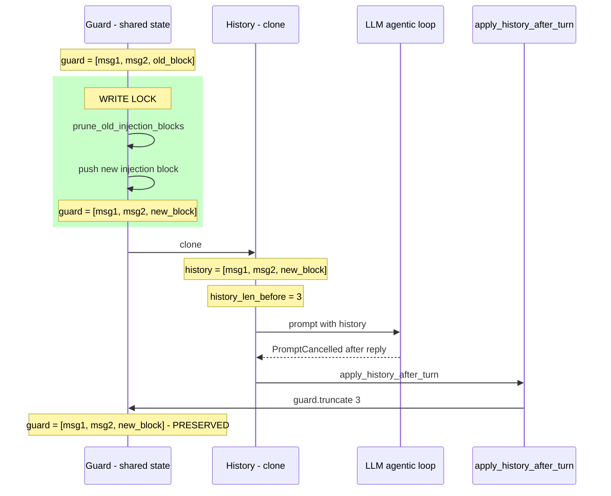

# Plan — Memory Injection V2 Fixes

## Phase 1 : Fixes immédiats (avant commit)

### 1.1 — Fix Bug 1 : Injection Persistence

**Fichier :** `src/agent/channel.rs`, fonction `run_agent_turn` (~lignes 1895-1926)

**Changement :** Déplacer l'injection mémoire dans le write lock du guard partagé, avant le clone. Le pattern est identique à ce qui est déjà fait pour les attachments (lignes 1896-1903).

**Code actuel :**
```
attachments → write guard → push → drop guard
clone guard → history
history_len_before = history.len()
injection → prune + push dans history (le clone)
LLM loop
apply_history_after_turn
```

**Code cible :**
```
attachments → write guard → push → drop guard
injection → write guard → prune + push dans guard → drop guard
clone guard → history (contient déjà l'injection)
history_len_before = history.len() (après injection)
LLM loop
apply_history_after_turn
```

**Détail des modifications :**

1. Déplacer le bloc lignes 1914-1926 (injection) AVANT le bloc lignes 1908-1912 (clone)
2. Changer `&mut history` en `&mut guard` dans le prune et le push
3. Prendre un write lock pour l'injection (comme pour les attachments)
4. `history_len_before` sera naturellement après injection car le clone inclut le bloc

**Impact sur les tests :**
- Les tests de `apply_history_after_turn` ne changent pas (ils testent la fonction isolée)
- Le test `prompt_cancelled_rolls_back` reste valide : le truncate préserve tout ce qui est en dessous de `history_len_before`, y compris l'injection
- Pas de nouveau test nécessaire pour cette correction (le comportement est déjà couvert par le design)

### 1.2 — Fix incohérence Settings.tsx

**Fichier :** `interface/src/routes/Settings.tsx`, ligne 1254

**Changement :** `0.85` → `0.70` dans le useEffect fallback

```tsx
// Avant
setContextualMinScore(settings.memory_injection.contextual_min_score ?? 0.85);
// Après
setContextualMinScore(settings.memory_injection.contextual_min_score ?? 0.70);
```

### 1.3 — Downgrader le logging

**Fichier :** `src/agent/channel.rs`, dans `compute_memory_injection`

Les 3 logs ajoutés par le dev cosine filtering :

| Log | Action |
|-----|--------|
| `tracing::info!(..., "memory injection config loaded")` | **Supprimer** — bruit inutile, la config est loggée au démarrage |
| `tracing::debug!(..., "cosine filter check")` | **Garder** — utile pour le debug, déjà en debug |
| `tracing::info!(..., "cosine relative threshold")` | **Downgrader en debug** — utile pour le tuning mais pas en production |

---

## Phase 2 : Build et tests

### 2.1 — Build

```bash
cargo build
```

### 2.2 — Tests unitaires

```bash
cargo test --lib agent::channel
cargo test --lib
```

Vérifier en particulier :
- `prompt_cancelled_rolls_back` — doit toujours passer
- `next_turn_is_clean_after_prompt_cancelled` — doit toujours passer
- Tous les tests `prune_old_injection_blocks` — doivent toujours passer

### 2.3 — Test live du cosine filtering

```bash
cargo run -- --debug start --foreground
```

Messages de test :
- **"Jamie Pine"** → doit retourner le fait Spacedrive VDFS
- **"boisson chaude"** → doit retourner café + bière uniquement
- **Long message de debug** → ne doit PAS retourner les 20 mémoires

Vérifier les logs :
```bash
grep "cosine relative threshold" ~/.spacebot/logs/spacebot.log.*
grep "cosine filter check" ~/.spacebot/logs/spacebot.log.*
```

Commencer avec ratio 0.70, ajuster si nécessaire.

---

## Phase 3 : Commit

Message suggéré :
```
fix: memory injection persistence + cosine relevance filtering

- Move injection to shared guard before clone (fixes block erasure on PromptCancelled)
- Disable graph traversal for injection (naive keyword matching floods RRF with stop-word hits)
- Replace RRF min_score filter with relative cosine threshold (adapts to message length)
- Align contextual_min_score default to 0.70 everywhere
- Update UI controls to cosine scale (0-1, step 0.01)
- Downgrade debug logging to appropriate levels
```

Fichiers à committer :
- `src/agent/channel.rs` (Bug 1 fix + Bug 2 cosine filter + logging)
- `src/config.rs` (default 0.70)
- `src/api/settings.rs` (fallback 0.70)
- `interface/src/routes/Settings.tsx` (slider + defaults 0.70)
- `interface/src/routes/AgentConfig.tsx` (slider)

Fichiers à NE PAS committer :
- `migrations/20260225000001_memory_injection_events.sql` — reliquat, garder untracked
- `migrations/20260225000002_memory_injection_historical.sql` — reliquat, garder untracked
- `memory-v2-plan/HANDOFF.md` — doc de référence, committer séparément si voulu
- `memory-v2-plan/IMPLEMENTATION 2/memory-injection-viz-plan.md` — plan futur

---

## Phase 4 : Pull upstream + merge (AVANT travail UI)

### 4.1 — Sync upstream

```bash
git fetch upstream
git merge upstream/main
```

Résoudre les conflits éventuels, en particulier dans :
- `interface/src/routes/Settings.tsx` (UI modifiée upstream)
- `interface/src/routes/AgentConfig.tsx` (possible)
- `src/agent/channel.rs` (possible si upstream a touché l'injection)

### 4.2 — Rebuild + retest après merge

```bash
cargo build
cargo test --lib
cd interface && bun run build
```

---

## Phase 5 : Travail UI (après merge upstream)

### 5.1 — Visualisation timeline des injections mémoire

Ré-implémenter le plan décrit dans `memory-v2-plan/IMPLEMENTATION 2/memory-injection-viz-plan.md`.
Les migrations sont déjà en place (`memory_injection_events` table).

### 5.2 — Refactor UI/UX des settings

À définir après avoir vu les changements upstream.

---

## Diagramme du fix Bug 1


