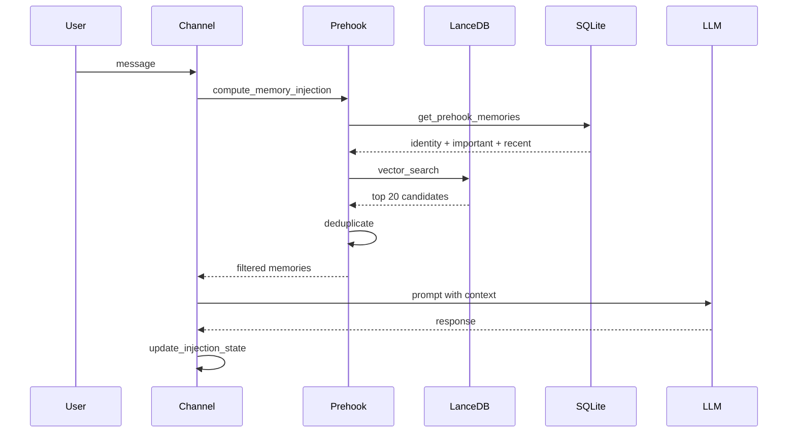

# Plan d'Implémentation Memory V2 - SpaceBot

## Résumé du Projet

Ce projet vise à améliorer le système de mémoire de SpaceBot en implémentant un **pre-hook systématique** avec **déduplication**, inspiré de MemOS. L'objectif est d'injecter automatiquement les mémoires pertinentes avant chaque tour LLM, sans appel LLM supplémentaire.

**Objectifs de performance:**
- Latence d'injection: < 200ms
- 0 redondance dans la fenêtre de contexte
- Injection invisible pour l'LLM

---

## Phase 1: État d'Injection en RAM

### 1.1 Créer la structure `ChannelInjectionState`

**Fichier:** `src/agent/channel.rs`

```rust
/// État de déduplication pour un channel.
/// Stocké en RAM directement dans Channel (pas dans ChannelState).
/// Utilise HashMap borné pour éviter les fuites mémoire.
pub struct ChannelInjectionState {
    /// memory_id -> turn_number (borné à 100 éléments)
    /// Ne PAS vider lors de la compaction (cf. REVUE_PERFECTIONNISTE.md section D)
    pub injected_ids: std::collections::HashMap<String, usize>,
    /// Buffer des embeddings injectés pour filtre sémantique
    pub semantic_buffer: Vec<Vec<f32>>,
}

impl ChannelInjectionState {
    /// Vérifie si une mémoire est encore dans la fenêtre de contexte.
    /// Retourne true si la mémoire doit être réinjectée (sortie du contexte).
    pub fn should_reinject(&self, memory_id: &str, current_turn: usize, context_window_depth: usize) -> bool {
        match self.injected_ids.get(memory_id) {
            Some(&injected_turn) => {
                // Réinjecter si la mémoire est sortie de la fenêtre
                injected_turn < current_turn.saturating_sub(context_window_depth)
            }
            None => true, // Jamais injectée, donc à injecter
        }
    }
}
```

### 1.2 Modifier la struct `Channel`

Ajouter les champs suivants à [`Channel`](src/agent/channel.rs:97):
- `current_turn: usize` - compteur de tours
- `injection_state: ChannelInjectionState` - état de déduplication

**Important:** Mettre dans `Channel`, pas dans `ChannelState` (qui est `Arc<RwLock>` partagé).
Les méthodes `handle_message` et `handle_message_batch` prennent `&mut self`.

### 1.3 Implémenter les méthodes de gestion

- `update_injection_state(memories: &[Memory])` - mettre à jour après injection
- `prune_injection_state()` - nettoyer les entrées anciennes (garder 100 max)

---

## Phase 2: Moteur de Recherche Pre-hook

### 2.0 Méthode Manquante à Ajouter

**⚠️ Important:** Il n'existe PAS de méthode pour filtrer les mémoires par fenêtre temporelle dans [`MemoryStore`](src/memory/store.rs).

**Fichier:** `src/memory/store.rs` (ajouter)

```rust
impl MemoryStore {
    /// Get memories created within the specified duration.
    /// 
    /// # Arguments
    /// * `since` - Duration back from now (e.g., Duration::hours(6))
    /// * `limit` - Maximum number of results
    /// * `channel_id` - Optional channel scope (si config.channel_scope = true)
    pub async fn get_recent_since(
        &self, 
        since: chrono::Duration, 
        limit: i64,
        channel_id: Option<&str>,
    ) -> Result<Vec<Memory>> {
        let cutoff = chrono::Utc::now() - since;
        
        let query = if let Some(cid) = channel_id {
            sqlx::query(
                r#"
                SELECT id, content, memory_type, importance, created_at, updated_at,
                       last_accessed_at, access_count, source, channel_id, forgotten
                FROM memories
                WHERE created_at >= ? AND channel_id = ? AND forgotten = 0
                ORDER BY created_at DESC
                LIMIT ?
                "#,
            )
            .bind(cutoff)
            .bind(cid)
            .bind(limit)
        } else {
            sqlx::query(
                r#"
                SELECT id, content, memory_type, importance, created_at, updated_at,
                       last_accessed_at, access_count, source, channel_id, forgotten
                FROM memories
                WHERE created_at >= ? AND forgotten = 0
                ORDER BY created_at DESC
                LIMIT ?
                "#,
            )
            .bind(cutoff)
            .bind(limit)
        };
        
        let rows = query.fetch_all(&self.pool).await
            .with_context(|| format!("failed to get recent memories since {}", cutoff))?;
        
        Ok(rows.into_iter().map(|row| row_to_memory(&row)).collect())
    }
}
```

### 2.1 SQL Pre-hook (SQLite)

**Fichier:** `src/memory/store.rs` (étendre)

Utilise les méthodes existantes + nouvelle méthode:

| Source | Méthode | Fichier |
|--------|---------|---------|
| Identity | [`get_by_type(MemoryType::Identity, limit)`](src/memory/store.rs:307-327) | Existant |
| Important | [`get_high_importance(0.8, limit)`](src/memory/store.rs:330-348) | Existant |
| Recent | [`get_recent_since(duration, limit, channel_id)`](src/memory/store.rs) | **À ajouter** |

**Configuration (nouveau):**

```rust
// Dans src/config.rs ou RuntimeConfig
pub struct PrehookConfig {
    /// Duration for "recent" memories (default: 6 hours)
    pub recent_duration: chrono::Duration,
    
    /// Whether to scope memories to current channel
    pub channel_scope: bool,
    
    /// Cosine similarity threshold for semantic deduplication
    pub semantic_threshold: f32,  // default: 0.85
    
    /// Maximum size of semantic buffer
    pub max_semantic_buffer: usize,  // default: 100
    
    /// Maximum memories to inject per turn
    pub max_injection_count: usize,  // default: 20
}
```

### 2.2 Vector Pre-hook (LanceDB)

**Fichier:** `src/memory/search.rs` (étendre)

1. Générer embedding du message utilisateur via `EmbeddingModel::embed_one()`
2. Recherche HNSW Top 20 dans LanceDB

```rust
impl MemorySearch {
    pub async fn prehook_search(&self, query: &str) -> Result<Vec<MemorySearchResult>> {
        let embedding = self.embedding_model.embed_one(query).await?;
        self.embedding_table.vector_search(&embedding, 20).await
    }
}
```

---

## Phase 3: Moteur de Déduplication

### 3.1 Fonction similarité cosinus

**Fichier:** `src/memory/search.rs`

```rust
pub fn cosine_similarity(a: &[f32], b: &[f32]) -> f32 {
    let dot: f32 = a.iter().zip(b.iter()).map(|(x, y)| x * y).sum();
    let mag_a: f32 = a.iter().map(|x| x * x).sum::<f32>().sqrt();
    let mag_b: f32 = b.iter().map(|x| x * x).sum::<f32>().sqrt();
    dot / (mag_a * mag_b + 1e-10)
}
```

### 3.2 Calcul des embeddings à la volée

**Problème:** `MemorySearch::search` retourne des `Memory`, pas leurs embeddings.

**Solution:** Appeler `embedding_model.embed_one(&memory.content)` à la volée.
Utiliser `FuturesUnordered` ou `tokio::join!` pour calcul concurrent.

```rust
// Calcul concurrent des embeddings pour le filtre sémantique
let embeddings: Vec<Vec<f32>> = futures::future::try_join_all(
    memories.iter().map(|m| embedding_model.embed_one(&m.content))
).await?;
```

### 3.3 Logique de filtrage

**Fichier:** `src/agent/channel.rs`

Méthode `compute_memory_injection(user_text: &str)`:
1. Filtre ID exact: `if injected_ids.contains_key(&memory.id) { skip }`
2. Filtre sémantique: `if max_cosine_similarity > 0.85 { skip }`

---

## Phase 4: Intégration Pipeline

### 4.1 Injection Silencieuse (Key Insight)

**Mécanisme:** Dans `run_agent_turn`, l'historique est cloné avant d'être envoyé à Rig:
```rust
let mut history = self.state.history.read().await.clone();
```

**Solution:** Passer un paramètre `injected_messages: Vec<Message>` à `run_agent_turn`
et les ajouter au clone. L'LLM les voit, mais elles ne sont pas sauvegardées en DB.

### 4.2 Modifier `handle_message`

**Fichier:** `src/agent/channel.rs` - méthode `handle_message()`

```rust
// 1. Pre-hook & Déduplication (seulement si message.source != "system")
let injected_messages = if message.source != "system" {
    self.compute_memory_injection(&user_text).await?
} else {
    Vec::new()
};

// 2. Appel LLM avec injection
let (result, skip_flag, replied_flag) = self
    .run_agent_turn(&user_text, &system_prompt, &conversation_id, attachment_content, injected_messages)
    .await?;

// 3. Post-hook
self.update_injection_state(&memories);
self.current_turn += 1;
```

### 4.3 Modifier `handle_message_batch`

**Important:** Le pre-hook s'exécute sur `combined_text`, pas sur chaque message du buffer.

```rust
// Pre-hook sur le texte combiné
let injected_messages = self.compute_memory_injection(&combined_text).await?;
```

### 4.4 Modifier `run_agent_turn`

Ajouter le paramètre `injected_messages: Vec<Message>`:

```rust
async fn run_agent_turn(
    &self,
    user_text: &str,
    system_prompt: &str,
    conversation_id: &str,
    attachment_content: Vec<UserContent>,
    injected_messages: Vec<Message>,  // NOUVEAU
) -> Result<...> {
    // ...
    let mut history = {
        let guard = self.state.history.read().await;
        guard.clone()
    };
    
    // Injection silencieuse - pas sauvegardé en DB
    for msg in injected_messages {
        history.push(msg);
    }
    // ...
}
```

---

## Phase 5: Tests & Validation

### 5.1 Tests unitaires

- `test_cosine_similarity` (identique, orthogonal, opposé)
- `test_deduplication_exact_id`
- `test_deduplication_semantic`

### 5.2 Tests d'intégration

- Flux de messages avec vérification de non-réinjection
- Reset lors de la compaction

### 5.3 Benchmarks

- Objectif: pre-hook complet < 200ms
- Scénario: 10,000 mémoires en base

---

## Points d'Attention (Gotchas) - CRITIQUE

### A. Coalescing (Batching)
**Problème:** Spacebot regroupe les messages rapides via `handle_message_batch`.
**Solution:** Le pre-hook s'exécute sur `combined_text`, pas sur chaque message du buffer.

### B. Messages Système (Re-triggers)
**Problème:** Quand un Worker/Branch termine, le système s'envoie un message `source == "system"`.
**Solution:** Désactiver le pre-hook pour les messages système.

### C. Buffer Sémantique et Embeddings
**Problème:** `MemorySearch::search` retourne des `Memory`, pas leurs embeddings.
**Solution:** Calculer les embeddings à la volée avec `FuturesUnordered` pour la concurrence.

### D. Interaction avec le Compactor
**Problème:** Que faire de `injected_ids` lors de la compaction?
**Solution:** NE PAS vider `injected_ids`. Si une mémoire a été injectée, elle a influencé la conversation.
Son essence est capturée dans le résumé. Vider `injected_ids` causerait des doublons.
Utiliser une structure bornée (HashMap max 100 entrées).

### E. Injection Silencieuse
**Key Insight:** L'historique est cloné dans `run_agent_turn` avant d'être envoyé à Rig.
Injecter dans le clone, pas dans l'historique permanent.

---

## Diagramme du Flux



---

## Ordre d'Implémentation Recommandé

1. **Phase 1.1** - Structure `ChannelInjectionState` dans `Channel`
2. **Phase 3.1** - Fonction `cosine_similarity` dans `search.rs`
3. **Phase 2.2** - Vector Pre-hook (LanceDB)
4. **Phase 3.2** - Calcul concurrent des embeddings
5. **Phase 3.3** - Logique de filtrage et déduplication
6. **Phase 4.1** - Modifier `run_agent_turn` pour accepter `injected_messages`
7. **Phase 4.2** - Intégration `handle_message` avec pre-hook
8. **Phase 4.3** - Intégration `handle_message_batch`
9. **Phase 2.1** - SQL Pre-hook (SQLite) - optionnel, peut venir après
10. **Phase 5** - Tests unitaires et d'intégration

---

## Analyse des Divergences avec l'Idée Initiale

### Divergence 1: Stockage de l'état d'injection (MAJEURE)

**Idée initiale:** Ajouter `last_injected_turn` et `is_dirty` dans la table SQLite `memories`:
```sql
ALTER TABLE memories ADD COLUMN last_injected_turn INTEGER;
ALTER TABLE memories ADD COLUMN is_dirty BOOLEAN DEFAULT FALSE;
```

**Plan actuel:** Stocker `injected_ids: HashMap<String, usize>` en RAM dans `Channel`.

**Analyse:**
- L'approche SQLite permet la persistence et le partage entre canaux
- MAIS crée des conflits entre channels (Discord, Slack, etc.) selon REVUE_PERFECTIONNISTE.md
- L'approche RAM est plus simple et évite les locks

**Résolution recommandée:** Garder l'approche RAM pour V1, mais réévaluer si besoin de persistence.

---

### Divergence 2: Flag `is_dirty` (IMPORTANTE)

**Idée initiale:** Flag `is_dirty` pour forcer réinjection des mémoires modifiées via edges `Updates`/`Contradicts`.

**Plan actuel:** Non mentionné.

**Analyse:**
- Le flag permet de gérer les mises à jour du graphe
- Si une mémoire #42 est mise à jour par #51, il faut réinjecter #42 avec la nouvelle info
- Sans ce flag, on risque d'avoir des informations obsolètes dans le contexte

**Résolution recommandée:** 
- Pour V1: Ignorer ce cas (complexité supplémentaire)
- Pour V2: Implémenter `is_dirty` avec écoute des événements du graphe

---

### Divergence 3: Reset lors de la compaction (CONTRADICTOIRE)

**Idée initiale:** Reset complet `last_injected_turn = NULL` sur toute la table lors de la compaction:
```sql
UPDATE memories SET last_injected_turn = NULL WHERE last_injected_turn IS NOT NULL
```

**REVUE_PERFECTIONNISTE.md:** NE PAS vider `injected_ids` car les mémoires ont influencé la conversation, leur essence est capturée dans le résumé.

**Analyse:**
- L'approche "reset" suppose que le contexte est effacé → tout peut être réinjecté
- L'approche "pas de reset" suppose que le résumé contient l'essence → réinjecter ferait doublon

**Résolution recommandée:** Suivre la REVUE_PERFECTIONNISTE.md (ne pas reset), car:
1. Le résumé de compaction capture l'essence des mémoires injectées
2. Réinjecter les mémoires brutes ferait doublon avec le résumé
3. Utiliser une structure bornée (max 100) pour éviter les fuites

---

### Divergence 4: Filtre par `context_window_depth` (TECHNIQUE)

**Idée initiale:** Vérifier si `last_injected_turn >= (current_turn - context_window_depth)`.

**Plan actuel:** Vérifier simplement la présence dans `injected_ids`.

**Analyse:**
- L'approche `context_window_depth` est plus précise: une mémoire injectée il y a 50 tours n'est plus dans le contexte
- L'approche simple suppose que tout ce qui a été injecté est encore dans le contexte

**Résolution recommandée:** 
- Implémenter le filtre par `context_window_depth` pour plus de précision
- Permet de réinjecter des mémoires qui sont sorties de la fenêtre de contexte

---

### Divergence 5: Format d'injection (MINEURE)

**Idée initiale:** Injecter dans le "system prompt".

**Plan actuel:** Injecter dans l'historique cloné via `run_agent_turn`.

**Analyse:** Les deux approches sont valides et invisibles pour l'LLM. L'injection dans l'historique cloné est plus simple à implémenter.

---

## Tableau Récapitulatif des Divergences

| Aspect | Idée initiale | Plan actuel | Résolution |
|--------|---------------|-------------|------------|
| Stockage état | SQLite (colonnes) | RAM (HashMap) | RAM pour V1 |
| Flag `is_dirty` | Oui | Non | V2 |
| Reset compaction | Oui (NULL) | Non (borné) | Non (REVUE) |
| Filtre depth | `context_window_depth` | Présence simple | Implémenter depth |
| Format injection | System prompt | Historique cloné | Historique cloné |

---

## Éléments Manquants Identifiés

### À Clarifier

1. **Format des messages injectés:** System message ou Context Block?
   - Recommandation: Utiliser un `Message::User` avec un préfixe clair type `[Context]`

2. **Gestion du flag `is_dirty`:** Si une mémoire est modifiée dans le graphe, faut-il la réinjecter?
   - Pour V1: Ignorer ce cas, traiter dans une itération future

3. **Configuration du seuil cosinus:** Hardcodé 0.85 ou configurable?
   - Recommandation: Ajouter dans `RuntimeConfig` pour flexibilité

4. **Limite du buffer sémantique:** Combien d'embeddings garder?
   - Recommandation: 50-100 maximum pour performance

5. **Filtre `context_window_depth`:** Implémenter le filtre par profondeur de fenêtre?
   - Recommandation: Oui, pour réinjecter les mémoires sorties du contexte
